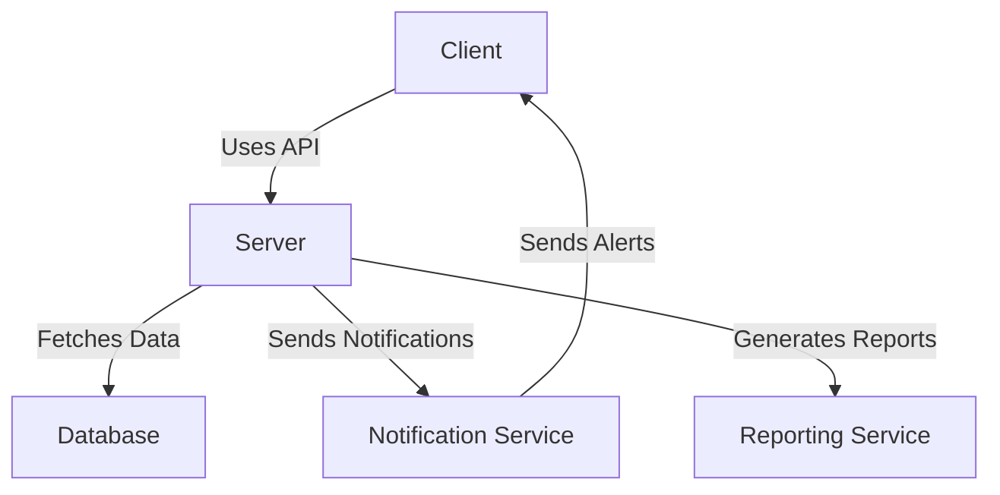

# Application Architecture Overview

```mermaid
graph TD;
    A[Client] -->|Uses API| B[Server];
    B -->|Fetches Data| C[Database];
    B -->|Sends Notifications| D[Notification Service];
    D -->|Sends Alerts| A;
    B -->|Generates Reports| E[Reporting Service];
```
